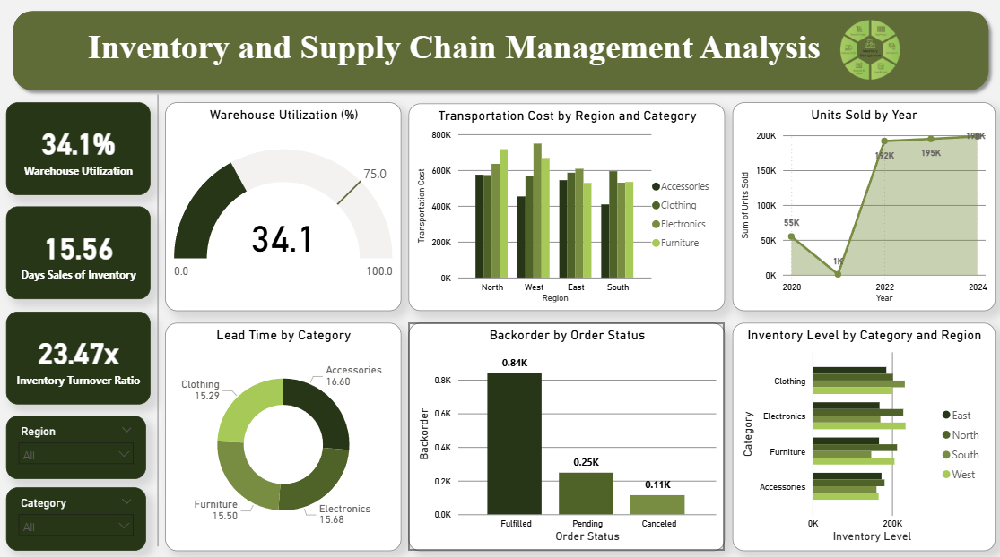

# 📦 Inventory & Supply Chain Analytics

An end-to-end **Power BI dashboard project** analyzing inventory levels,
supply chain performance, and order fulfillment across regions and product categories.

---

## 📌 Project Overview

This project analyzes inventory and supply chain data to uncover insights around
warehouse utilization, inventory turnover, transportation costs, lead times,
and order fulfillment status. The goal is to help businesses optimize stock levels,
reduce backorders, and improve supply chain efficiency.

---

## 🛠️ Tools & Technologies Used

| Tool | Purpose |
|------|---------|
| **Excel / CSV** | Data storage |
| **Power BI** | Interactive dashboard & visualizations |

---

## 📊 Key Metrics

- 🏭 **Warehouse Utilization:** 34.1%
- 📅 **Days Sales of Inventory:** 15.56 days
- 🔄 **Inventory Turnover Ratio:** 23.47x

---

## 💡 Key Insights

- **Sales grew sharply post-2021**, rising from just 1K units to ~198K by 2024
- **Furniture drives the highest transportation cost in North**, while **Electronics leads in West and East**, and **Clothing leads in South**
- **~70% of backordered orders were successfully fulfilled** (0.84K), with the rest still pending or canceled
- **North holds the highest inventory levels** across most categories, except Electronics, where West leads
- **Lead times remained stable across categories**, ranging between 15–17 days
- **Warehouse Utilization at just 34.1%** indicates significant available storage capacity

---

## 📁 Project Structure

---

## 📸 Dashboard Preview

